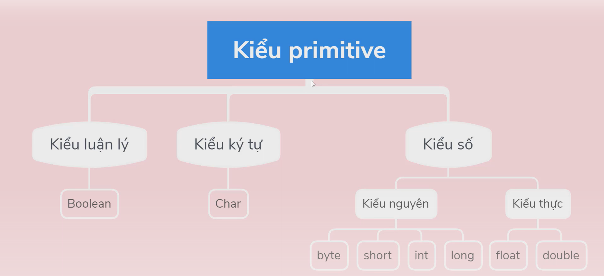

# Ngon ngu java la gi
Ngôn ngữ lập trình Java là một ngôn ngữ lập trình hướng đối tượng (Object-Oriented Programming - OOP), dựa trên lớp (class-based), được thiết kế để có tính độc lập nền tảng cao.

# Ly do java ra doi
1. Nhu cầu về Tính Độc lập Nền tảng
   Đây là lý do quan trọng nhất, được thể hiện qua triết lý "Viết một lần, chạy mọi nơi"

   Vấn đề của C/C++: Các ngôn ngữ lập trình phổ biến trước đó thường biên dịch ra mã máy cụ thể cho một kiến trúc phần cứng và hệ điều hành nhất định. Để chạy cùng một chương trình trên Windows, macOS và Linux, lập trình viên phải biên dịch lại mã nguồn cho từng nền tảng.

    Giải pháp của Java: Java sử dụng Máy ảo Java (JVM) làm lớp trung gian. Mã nguồn Java được biên dịch thành Bytecode, sau đó Bytecode này có thể chạy trên bất kỳ hệ thống nào có cài đặt JVM tương ứng.
2. Phát triển Ứng dụng cho Thiết bị Điện tử Tiêu dùng
    Mục đích tạo ra một ngôn ngữ lập trình cho các thiết bị điện tử nhúng như TV thông minh, hộp set-top box và các thiết bị gia dụng khác.

    Các thiết bị này có nhiều loại CPU và hệ điều hành khác nhau, càng củng cố nhu cầu về một ngôn ngữ có tính di động cao.
3. Khắc phục những Khuyết điểm của C/C++
   
    Các nhà phát triển Java đã cố gắng loại bỏ những yếu tố phức tạp và dễ gây lỗi của C/C++, tạo ra một ngôn ngữ đơn giản và mạnh mẽ hơn:

        Đơn giản hóa: Loại bỏ các tính năng phức tạp như con trỏ (pointers), nạp chồng toán tử (operator overloading) và đa kế thừa (multiple inheritance), giúp lập trình viên dễ học và ít mắc lỗi hơn.

        Quản lý Bộ nhớ Tự động: Java tích hợp tính năng Garbage Collection (Thu gom Rác), tự động giải phóng bộ nhớ không cần dùng, giúp lập trình viên tránh được các lỗi rò rỉ bộ nhớ (memory leak) phổ biến trong C/C++.

        Bảo mật: Java được thiết kế với mô hình bảo mật mạnh mẽ ngay từ đầu, cho phép thực thi mã một cách an toàn, đặc biệt quan trọng trong môi trường mạng internet.

# Cach java hoat dong

1. Giai doan bien dich
   Đây là giai đoạn đầu tiên, chuyển mã nguồn mà lập trình viên viết thành mã trung gian.
   Ma nguon se duoc bien dich, tu ma nguon chuyen thanh Bytecode (gan giong ma nhi phan nhung duoc thiet ke de chay tren 1 may ao)
2. Giai doan thuc thi
   Đây là giai đoạn mà Bytecode được chuyển thành mã máy thực tế để CPU có thể xử lý.

   Tai ma bytecode ve kiem tra xem co hop lệ khong, neu co luc nay se chuyen tu bytecode sang ma may bang 1 trong 2 cach:
    Dich tung dong 1
    Hoac giong voi snippets luu lai cac doan code thuong dung de khoi phai dich lai giup tang toc do chay

# Cau truc 1 chuong trinh java

1. Thanh phan goi
    Dinh nghia: la thu muc dung de tô chuc cac lop co lien quan. No giup tranh xung dot ten va cau truc du an
    Cu phap: Luôn đứng ở dòng đầu tiên của tệp.
2. Lenh nhap
3. Khai bao lop
4. Noi dung lop
5. Phuong thuc chinh

# Khai bao kieu du lieu nguyen thuy
   
   Khai báo như bình thường

# Vòng lặp trong java
Như bình thường

# Cấu trúc lệnh rẽ nhánh
Như bình thường

# Mảng trong java
Như bình thường

# Tổng quan

1. Class và Object (Lớp và Đối tượng)
Class (Lớp) 🏭
Định nghĩa: Là một bản thiết kế (blueprint), hoặc khuôn mẫu để tạo ra các đối tượng. Nó định nghĩa thuộc tính (trạng thái) và phương thức (hành vi) chung của một nhóm đối tượng.

Đặc điểm: Class là một thực thể logic (không chiếm bộ nhớ khi khai báo).

Cú pháp: Sử dụng từ khóa class.

Object (Đối tượng) 🧱
Định nghĩa: Là một thể hiện (instance) cụ thể của một Class. Nó là một thực thể trong thế giới thực được mô hình hóa.

Đặc điểm: Object là một thực thể vật lý (chiếm bộ nhớ khi được tạo).

Tạo đối tượng: Sử dụng từ khóa new và gọi constructor của Class.

ClassName objectName = new ClassName();

Đây là tổng quan về Class (Lớp), Object (Đối tượng) và các thành phần cốt lõi trong Lập trình Hướng đối tượng (OOP) bằng Java.

1. Class và Object (Lớp và Đối tượng)
Class (Lớp) 🏭
Định nghĩa: Là một bản thiết kế (blueprint), hoặc khuôn mẫu để tạo ra các đối tượng. Nó định nghĩa thuộc tính (trạng thái) và phương thức (hành vi) chung của một nhóm đối tượng.

Đặc điểm: Class là một thực thể logic (không chiếm bộ nhớ khi khai báo).

Cú pháp: Sử dụng từ khóa class.

Object (Đối tượng) 🧱
Định nghĩa: Là một thể hiện (instance) cụ thể của một Class. Nó là một thực thể trong thế giới thực được mô hình hóa.

Đặc điểm: Object là một thực thể vật lý (chiếm bộ nhớ khi được tạo).

Tạo đối tượng: Sử dụng từ khóa new và gọi constructor của Class.

Java

ClassName objectName = new ClassName();

2. Các Thành Phần Cơ Bản trong Class
2.1. Từ Khóa this 🎯
Từ khóa this là một tham chiếu (reference) đến đối tượng hiện tại (current object) bên trong một phương thức hoặc constructor.

2.2 Constructor

Định nghĩa: Là một loại phương thức đặc biệt được gọi tự động khi một đối tượng được tạo bằng từ khóa new.

Mục đích: Khởi tạo (cấp giá trị ban đầu) cho các biến instance (thuộc tính) của đối tượng mới được tạo.

Đặc điểm:

Tên constructor phải trùng với tên Class.

Không có kiểu trả về (kể cả void).

Phân loại:

Constructor mặc định (Default Constructor): Không có tham số. Nếu bạn không định nghĩa constructor nào, Java sẽ cung cấp một constructor mặc định không tham số.

Constructor có tham số (Parameterized Constructor): Nhận tham số để khởi tạo các thuộc tính.

2.3. Access Modifier (Bộ Chỉ định Truy cập) 🔒
Xác định phạm vi truy cập của các thành phần (thuộc tính, phương thức, constructor, class) trong Java.

2.4. Getter và Setter (Accessors) 📞
Đây là các phương thức công khai (public) được sử dụng để truy cập và sửa đổi các thuộc tính private của một Class, thực hiện nguyên tắc Đóng gói (Encapsulation).

Getter (Accessor): Phương thức đọc giá trị của thuộc tính. Tên thường bắt đầu bằng get
public String getName() {
    return this.name;
}
Setter (Mutator): Phương thức thay đổi giá trị của thuộc tính. Tên thường bắt đầu bằng set. Có thể chứa logic kiểm tra hợp lệ (validation) trước khi gán giá trị.

2.5. Từ Khóa static 🌐
Từ khóa static được dùng để khai báo các thành phần thuộc về Class chứ không phải thuộc về một đối tượng cụ thể.